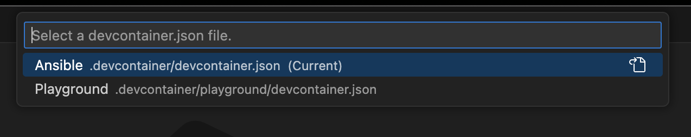

# Ansible Template

This project provides a devcontainer template for Ansible, ready to be used for yhour next Ansible project.

- [Requirements](#requirements)
- [Quick Start](#quick-start)
- [Cross-Platform](#cross-platform)
- [Restart/Rebuild Container](#restartrebuild-container)
- [Working Directory](#working-directory)
- [Home Directory](#home-directory)
- [SSH](#ssh)
- [Ansible Vault](#ansible-vault)
- [Ansible Galaxy](#ansible-galaxy)
  - [Collections](#collections)
  - [Roles](#roles)
- [Ansible Reference Information](#ansible-reference-information)
- [Playground](#playground)
  - [Switch Container](#switch-container)
  - [Start Playground](#start-playground)
  - [Stop Playground](#stop-playground)
  - [Restart Playground](#restart-playground)
  - [Security](#security)
  - [hosts](#hosts)
  - [Ansible Playground Commands](#ansible-playground-commands)
    - [ansible-playground](#ansible-playground)
    - [ansible-playground-playbook](#ansible-playground-playbook)

## Requirements

- docker
- Editor with Dev Container support (e.g. VS Code)

When you are using VS Code the following extension is required to enable Dev Container Support: [ms-vscode-remote.remote-containers](https://marketplace.visualstudio.com/items?itemName=ms-vscode-remote.remote-containers)

## Quick Start

- Clone repository
- Open in VS Code
- Start Dev Container
- Enjoy !

## Cross-Platform

This is a cross-platform development container project, which means it is designed to work out-of-the-box on the following platforms.

| Platform       | Tested             |
| -------------- | ------------------ |
| Darwin (MacOS) | :white_check_mark: |
| Linux          | :white_check_mark: |
| Windows        | :white_check_mark: |

## Restart/Rebuild Container

The devcontainer can be restarted by opening the Command Pallete of VS Code with CMD + SHIFT + P (MacOS) or CTRL + SHIFT + P (Windows/Linux) and then choose the option `Dev Containers: Rebuild Container`.

## Working Directory

The working directory in the devcontainer is `/work`.

## Home Directory

The home directory `~` in the devcontainer is `/home/vscode`.

## SSH

To protect existing SSH keys against overwriting, the user's .ssh directory is mounted as READONLY, which the exception of the SSH Config in `.ssh/config` and known hosts configuration in `.ssh/known_hosts`. Furthermore, a new directory `.ssh/ansible` is created which is mounted READWRITE to allow the user of this project to store new SSH keys in regards to this project. All the mounts regarding SSH are mounted in the devcontainer in the home directory of the `vscode` user `~` at `/home/vscode/.ssh` which ensures that all ssh commands and ansible commands works as expected.

If the user desires to change this the following files require updates:

- .devcontainer/devcontainer.json
- .devcontainer/scripts/initialize
- .devcontainer/scripts/initialize.cmd

## Ansible Vault

During container startup an Ansible Vault Password file is written to the user host at `${HOME}/.ansible_vault_pass` this file is empty.
This file is then mounted in the devcontainer at `~/.ansible_vault_pass`
Use the following command to set the Ansible Vault Password.

```shell
echo 'password' > ~/.ansible_vault_pass
```

If you want to secure a value within this project after you have set the password, it is as simple as selecting the value, then opening the VS Code Command Pallet with `Command + Shift + P` (MacOS) or `Ctrl + Shift + P` (Linux/Windows) and selecting `Ansible Vault: Encrypt/Decrypt via 'ansible-vault'`. You can use this option
to either decrypt or encrypt.

## Ansible Galaxy

Ansible Galaxy collections and/or roles can be added into the `requirements.yml` configuration. After updating restarting the container through VSCode is enough to trigger the installation of the requested collections/roles. The collections/roles are installed into the project folder at `.ansible`. The provided Ansible configuration (`ansible.cfg`) is configured to make use of these directories. The installation commands are provided by the `.devcontainer/scripts/postStartCommand.sh` script.

If manual installation is required the following commands can be used.

### Collections

```shell
ansible-galaxy collection install --force --collections-path .ansible/collections -r requirements.yml
```

### Roles

```shell
ansible-galaxy role install --force --roles-path .ansible/roles -r requirements.yml
```

## Ansible Reference Information

If you require something more complex please see the following [Ansible Documentation](https://docs.ansible.com/ansible/latest/tips_tricks/sample_setup.html) about sample project setups and modify this repository after cloning to your own requirements.

## Playground

This repository comes also with an [Ansible Playground](https://github.com/gjrtimmer/ansible-playground-docker). The playground can be used be loading the playground devcontainer. When VSCode asks to start the devcontainer when opening the repository it will show that there are two devcontainers available.

- Ansible
- Playground

The `Ansible` devcontainer is the default devcontainer when you want to use this repository to kickstart your ansible project. The `Playground` devcontainer is identical with the difference that it will have docker-in-docker enabled. This allows you to start the playground within the devcontainer.

The playground can be controlled through the shell command `playground`. It has various subcommands to interact with the playground.
When the playground is started the first time it will clone the `ansible-playground-docker` repository from GitHub and install it in the repository in the `.playground` directory. On the initial clone it will ask if you want to load the playground inventory.

Loading the playground inventory is not mandatory. You can interact with the playground nodes without loading the inventory through the provided playground inventory in the `.config` directory.

### Switch Container

You can switch devcontainers between the `Ansible` and `Playground` devcontainer with the `Switch Container` command from the `Command Pallete` in VS Code.
In order to switch open the command pallete with `Command + Shift + P` (MacOS) or `Ctrl + Shift + P` (Linux/Windows) and choose the option `Switch Container`.



### Start Playground

To start the playground run the following command, this will also install the playground if not present.

```shell
playground start
```

### Stop Playground

To stop the playground run the following command.

```shell
playground stop
```

### Restart Playground

To restart the playground run the following command.

```shell
playground restart
```

### Security

Because the playground runs in docker and hostname identification can change, this has been disabled for the playground nodes to ensure the most conveniant interaction.

### hosts

The playground servers are grouped under the name `nodes`. See [.config/hosts.playground.yml](.config/hosts.playground.yml) for details.

### Ansible Playground Commands

There are 4 additional `shell` aliases loaded into the shell which will give you easy control and interaction with the playground. These 4 aliases are only for 2 command redirects one long form and a short form.

#### ansible-playground

The `ansible-playground` command is an alias to the `ansible` command with the additional inventory parameter `-i` to load the playground inventory from `.config`. Instead of manually putting in the inventory override, this command can be called like any normal `ansible` command but it will interact with the playground nodes when they are started.

> Alias: `ansible-playground` => `ansible -i /work/.config/hosts.playground.yml`
> Alias: `ansible-pg` => Short form of `ansible-playground` for usability

The following example will ping all the playground nodes.

```shell
ansible-playground all -m ping
```

#### ansible-playground-playbook

The `ansible-playground-playbook` command is an alias to the `ansible-playbook` command with the additional inventory parameter `-i` to load the playground inventory from `.config`. Instead of manually putting in the inventory override, this command can be called like any normal `ansible-playbook` command but it will interact with the playground nodes when they are started.

> Alias: `ansible-playground-playbook` => `ansible-playbook -i /work/.config/hosts.playground.yml`
> Alias: `ansible-pp` => Short form of `ansible-playground-playbook` for usability

The following example will run a playbook against the playground nodes.

```shell
ansible-playground -l nodes playbooks/playbook.yml
```
